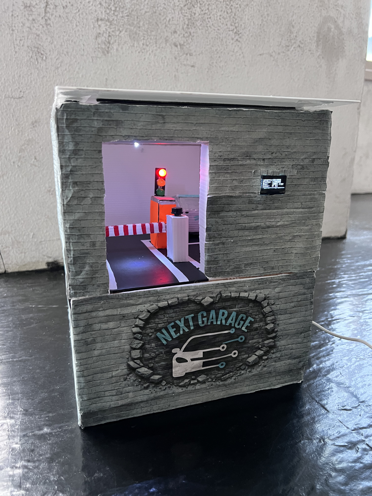
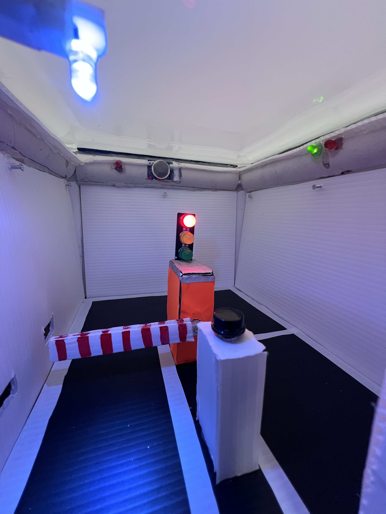
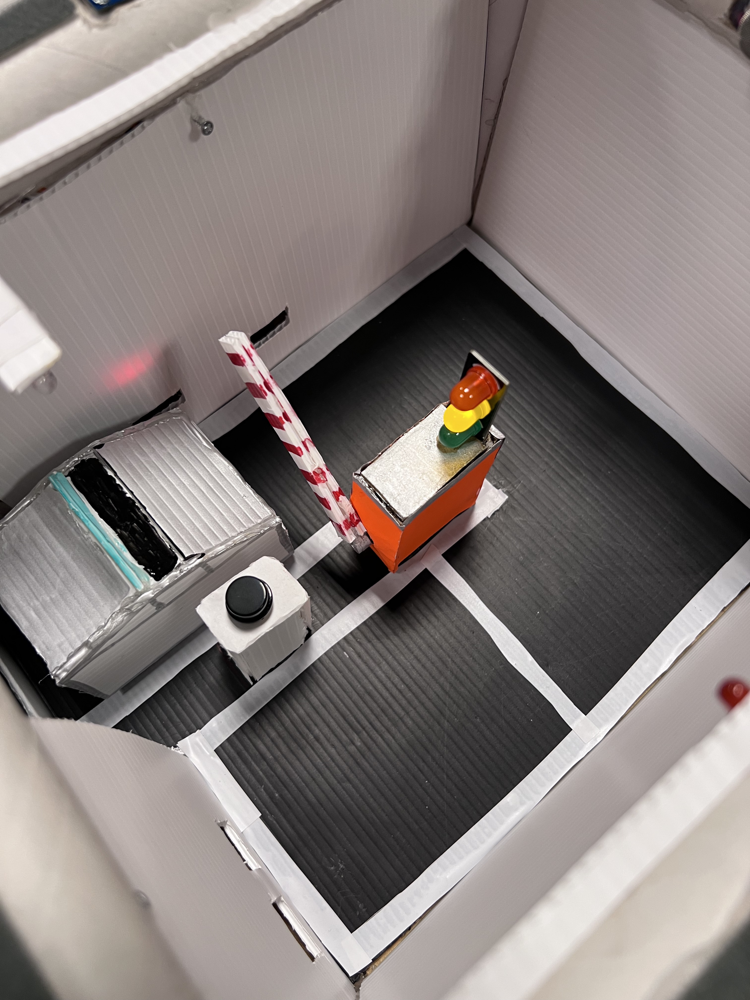
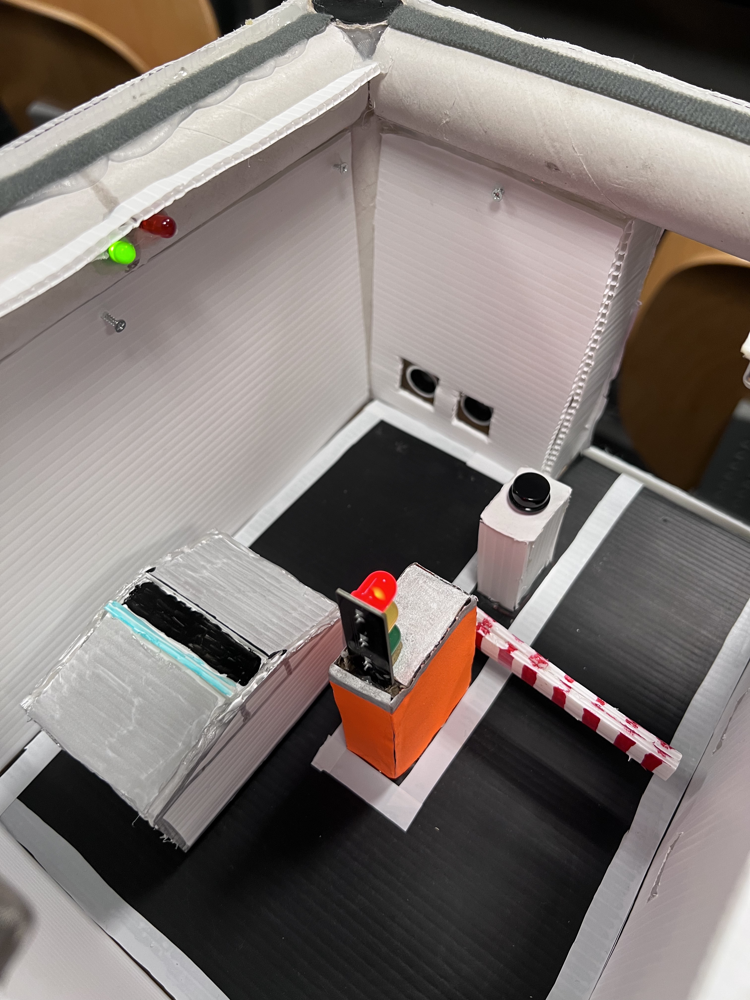
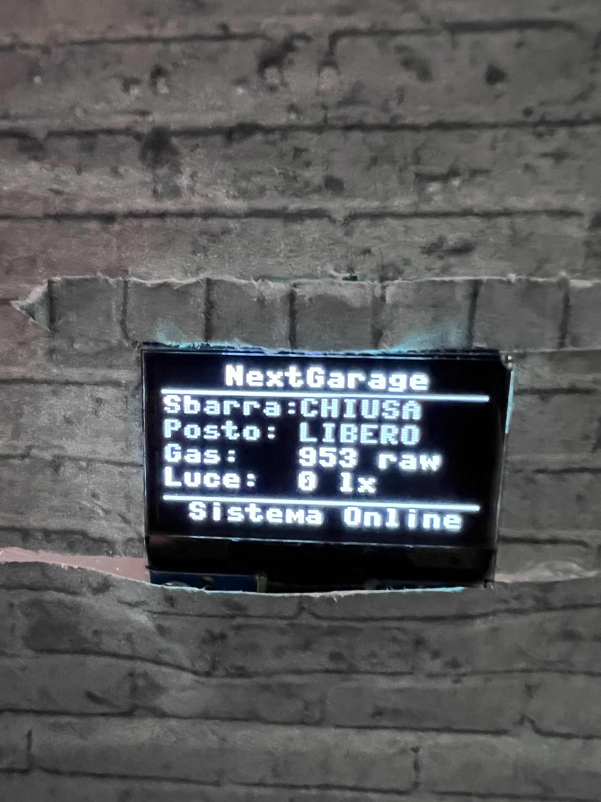
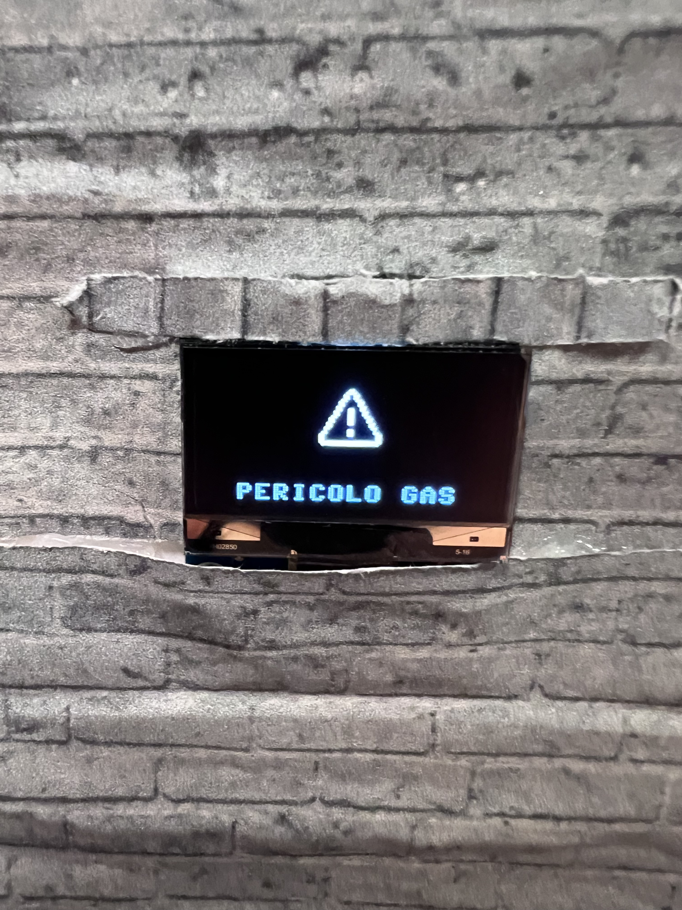
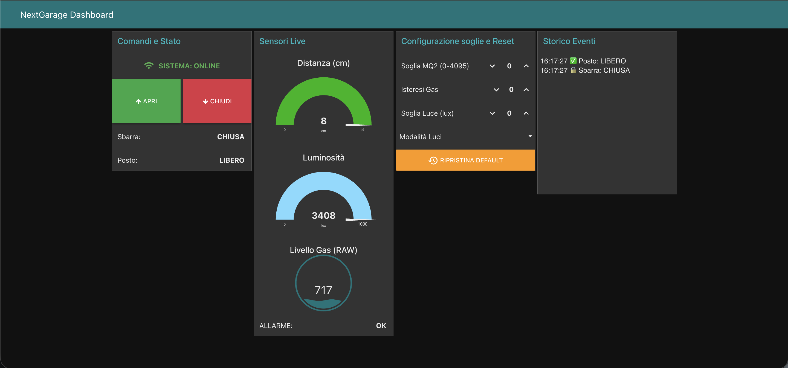

# NextGarage IoT System 🚗

Smart parking management system with automated gate control, real-time monitoring, and cloud connectivity using ESP32 microcontroller.

> 🎓 This project was developed as part of the 2025/26 **Internet of Things course** at the  
> **Università degli Studi di Salerno (University of Salerno, Italy).**

---

## 📌 Table of Contents

1. [Project Overview](#-project-overview)  
2. [Technologies & Dependencies](#-technologies--dependencies)   
3. [Main Features](#-main-features)  
4. [Hardware Components](#-hardware-components)  
5. [Project Architecture](#-project-architecture)  
6. [System States & Logic](#-system-states--logic)
7. [MQTT Integration](#-mqtt-integration)
8. [Configuration & Thresholds](#-configuration--thresholds)
9. [Setup & Installation](#-setup--installation)
10. [Node-RED Dashboard](#-node-red-dashboard)
11. [Team Members](#-team-members)

---

## 🔍 Project Overview

**NextGarage** is an intelligent single-space parking management system that combines:

- **Automated barrier control** with IR sensors for entry/exit detection
- **Real-time parking spot monitoring** using ultrasonic distance sensors
- **Environmental safety** with gas leak detection (MQ2 sensor)
- **Automatic lighting control** based on ambient brightness (TSL2561 sensor)
- **Remote monitoring and control** via MQTT protocol and Node-RED dashboard
- **OLED display** for local status visualization with custom graphics

The system is built on **ESP32** microcontroller running **MicroPython**, providing a complete IoT solution for smart parking management with cloud connectivity.

---

## 🛠 Technologies & Dependencies


- **Microcontroller:** ESP32 (dual-core, WiFi/Bluetooth)
- **Programming Language:** MicroPython 1.20+
- **Communication Protocol:** MQTT (HiveMQ public broker)
- **Display Driver:** SSD1306 (I2C OLED 128x64)
- **Sensors:**
  - HC-SR04 Ultrasonic Distance Sensor
  - IR Obstacle Detection Sensors
  - MQ2 Gas Sensor (Analog ADC)
  - TSL2561 Ambient Light Sensor (I2C)
- **Dashboard:** Node-RED for remote monitoring and control
- **Libraries:**
  - `umqtt.simple` - MQTT client
  - `ssd1306` - OLED display driver
  - `framebuf` - Graphics rendering

---

## ✅ Main Features

### 🚧 Automated Gate Control
- **Entry detection** via IR sensor with traffic light signals (Red → Green)
- **Exit detection** with priority opening (automatic bypass)
- **Manual control** via physical button or MQTT commands
- **Safety system** prevents closing if vehicle detected
- **Smooth servo movement** with configurable speed

### 🅿️ Intelligent Parking Management
- **Ultrasonic distance monitoring** with advanced filtering algorithms
  - Trimmed mean filter (discards outliers)
  - Low-pass filter for signal smoothing
  - Hysteresis for stable state transitions
- **Parking assistance** with progressive buzzer feedback
- **Visual indicators** (Red/Green LEDs) for spot occupancy
- **Automatic state confirmation** with configurable delay timers

### 🛡️ Safety & Environmental Monitoring
- **Gas leak detection** with configurable threshold and hysteresis
- **Visual/audio alarm** on gas detection (LED + buzzer)
- **Automatic lighting control** based on ambient light levels
  - AUTO mode: lights on when lux < threshold
  - Manual ON/OFF override via MQTT

### 📊 Real-Time Monitoring & Control
- **OLED display** with custom bitmap graphics:
  - Main status screen (gate, parking, gas, light)
  - Parking assistance screen with progress bar
  - Gas alarm screen with warning icon
  - Connection status icons (WiFi, MQTT, System Reset)
- **MQTT telemetry** published every 2 seconds:
  - Gate state, parking occupancy, distance
  - Gas level (raw ADC values), alarm status
  - Ambient light (lux)
- **Remote configuration** via MQTT:
  - Adjustable sensor thresholds
  - Light mode selection
  - Gate control commands

---

## 🔧 Hardware Components

| Component | Pin | Description |
|-----------|-----|-------------|
| **OLED Display** | SDA: 21, SCL: 22 | 128x64 I2C display (SSD1306) |
| **TSL2561 Light Sensor** | I2C (0x39) | Ambient light measurement |
| **IR Entrance Sensor** | GPIO 14 | Vehicle entry detection |
| **IR Exit Sensor** | GPIO 26 | Vehicle exit detection |
| **Ultrasonic Sensor** | TRIG: 5, ECHO: 18 | Distance measurement (parking spot) |
| **MQ2 Gas Sensor** | GPIO 34 (ADC) | Gas leak detection |
| **Servo Motor** | GPIO 15 (PWM) | Barrier gate control |
| **Traffic Light** | R: 27, Y: 4, G: 2 | Entry signaling |
| **Parking LEDs** | Red: 16, Green: 33 | Spot occupancy indicator |
| **Buzzer** | GPIO 17 (PWM) | Parking assist + gas alarm |
| **Parking Light** | GPIO 25 | Automatic/manual lighting |
| **Alarm LED** | GPIO 13 | Gas alarm indicator |
| **Gate Button** | GPIO 12 | Manual gate control |
| **Master Button** | GPIO 32 | System reset (5s hold) |

---

## 🧱 Project Architecture

```
NextGarage-IoT-System/
├── boot.py                 # System boot sequence
├── main.py                 # Main entry point with error handling
├── config.py               # Configuration and thresholds
├── parking.py              # Core system logic and state machine
├── mqtt_handler.py         # MQTT communication manager
├── ssd1306.py              # OLED display driver
├── tsl2561.py              # Light sensor driver
├── sensors/
│   ├── ir_sensor.py        # IR obstacle detection
│   ├── ultrasonic.py       # Distance measurement
│   ├── mq2.py              # Gas sensor with calibration
│   └── brightness_sensor.py # TSL2561 wrapper
├── actuators/
│   ├── servo_gate.py       # Barrier control state machine
│   ├── buzzer.py           # Audio feedback (parking/alarm)
│   ├── parking_leds.py     # Spot status LEDs
│   ├── parking_light.py    # Automatic lighting
│   └── traffic_light.py    # Entry traffic signals
├── net/
│   ├── mqtt_client.py      # MQTT client wrapper
│   └── wifi_manager.py     # WiFi connection handler
├── input/
│   └── button.py           # Button debouncing and press detection
└── display/
    └── oled_display.py     # Display UI with custom graphics
```

---

## 🔄 System States & Logic

### Gate State Machine
The servo gate operates through a finite state machine with 6 states:

1. **IDLE (0)** - Gate closed, red light on
   - Monitors entry IR sensor
   - Blocks entry if parking is full
   - Allows exit with priority

2. **GREEN (1)** - Ready for entry
   - Green light on, waiting for button press
   - Returns to IDLE if vehicle leaves
   - Still allows exit override

3. **OPENING (2)** - Gate opening
   - Yellow light blinking
   - Smooth servo movement (90° in steps)
   - Transitions to WAIT_CLEAR or MANUAL_OPEN

4. **WAIT_CLEAR (3)** - Gate open, auto mode
   - Waits for vehicle to clear sensors (1s delay)
   - Automatically closes when safe

5. **CLOSING (4)** - Gate closing
   - Yellow light blinking
   - Safety check: reopens if obstacle detected
   - Returns to IDLE when closed

6. **MANUAL_OPEN (5)** - Gate open, manual mode
   - Stays open until remote close command
   - Requires explicit MQTT command to close

### Parking State Logic
- **Distance filtering:** 7-sample burst → discard min/max → low-pass filter (70% new, 30% old)
- **Occupancy detection:** Distance ≤ 3cm for 3 seconds → OCCUPIED
- **Vacancy detection:** Distance > 9cm for 2 seconds → FREE
- **Parking assist zones:**
  - **< 3cm:** STOP (continuous tone)
  - **3-5cm:** Slow down (medium frequency)
  - **5-7cm:** Approach (low frequency)
  - **> 7cm:** No assist

---

## 📡 MQTT Integration

### Connection Details
- **Broker:** `broker.hivemq.com` (public HiveMQ)
- **Port:** 1883
- **Client ID:** `nextgarage-esp32`

### Published Topics (Telemetry)
```
parking/state/gate          → "CHIUSA" / "APERTA" / "APERTURA" / "CHIUSURA"
parking/state/spot          → "LIBERO" / "OCCUPATO"
parking/ultrasonic/distance → Distance in cm (0.0-8.0, capped for dashboard)
parking/sensors/gas         → Raw ADC value (0-4095)
parking/alarms/gas          → "OK" / "ALLARME!"
parking/env/light           → Ambient light in lux
```

### Subscribed Topics (Commands)
```
parking/cmd/open_gate           → Open gate remotely
parking/cmd/close_gate          → Close gate (if safe)
parking/cmd/parking_light_mode  → "AUTO" / "ON" / "OFF"
parking/cmd/reset_config        → Reset all thresholds to defaults
```

### Configuration Topics (Dynamic Thresholds)
```
parking/cfg/mq2_threshold       → Gas alarm threshold (raw ADC)
parking/cfg/mq2_hyst            → Gas alarm hysteresis
parking/cfg/lux_threshold       → Auto-light activation threshold
```

---

## ⚙️ Configuration & Thresholds

All configurable parameters are in `config.py` and can be updated dynamically via MQTT:

### Distance Thresholds (Ultrasonic)
```python
ULTRASONIC_MIN_DISTANCE = 3      # cm - parking spot occupied
ULTRASONIC_MAX_DISTANCE = 7      # cm - detection range
ULTRASONIC_OCCUPIED_CONFIRM = 3000  # ms - confirmation delay
ULTRASONIC_FREE_CONFIRM = 2000      # ms - vacancy confirmation
```

### Gas Sensor (MQ2)
```python
MQ2_THRESHOLD = 1500        # Raw ADC value for alarm
MQ2_HYSTERESIS = 200        # Prevent alarm flapping
```

### Ambient Light (TSL2561)
```python
LUX_THRESHOLD = 50          # Lux - below this = lights ON (AUTO mode)
```

### Servo & Timing
```python
SERVO_OPEN_ANGLE = 90       # Logical open position
SERVO_CLOSE_ANGLE = 0       # Logical closed position
SERVO_STEP = 2              # Degrees per movement
SERVO_INTERVAL = 30         # ms between steps
```

---

## 🚀 Setup & Installation

### Prerequisites
- **ESP32 development board** (30-pin or compatible)
- **MicroPython firmware** v1.20 or higher installed on ESP32
- **Thonny IDE** or similar for file upload
- **Node-RED** (optional, for dashboard)

### 1️⃣ Flash MicroPython
Download and flash MicroPython firmware to ESP32:
```bash
esptool.py --port /dev/ttyUSB0 erase_flash
esptool.py --port /dev/ttyUSB0 write_flash -z 0x1000 esp32-xxxxxx.bin
```

### 2️⃣ Configure WiFi & MQTT
Edit `config.py` to set your credentials:
```python
WIFI_SSID = "YourNetworkName"
WIFI_PASSWORD = "YourPassword"

# MQTT settings (or use default HiveMQ public broker)
MQTT_BROKER = "broker.hivemq.com"
MQTT_PORT = 1883
```

### 3️⃣ Upload Files to ESP32
Using Thonny or ampy, upload all files maintaining the folder structure:
```bash
# Upload all Python files to ESP32
ampy --port /dev/ttyUSB0 put boot.py
ampy --port /dev/ttyUSB0 put main.py
ampy --port /dev/ttyUSB0 put config.py
# ... (continue for all files)
```

### 4️⃣ Hardware Assembly
1. Connect all sensors and actuators according to pin mapping in [Hardware Components](#-hardware-components)
2. Ensure I2C devices (OLED, TSL2561) share SDA/SCL bus
3. Use external 5V power for servo motor (not from ESP32)
4. Connect ground (GND) common to all components

### 5️⃣ Power On & Test
```bash
# Connect to ESP32 serial console
screen /dev/ttyUSB0 115200

# System will:
# 1. Show NextGarage logo on OLED
# 2. Connect to WiFi (with icon animation)
# 3. Connect to MQTT broker (cloud icon)
# 4. Start main monitoring loop
```

### 🎛️ System Controls
- **Short press gate button:** Open gate (when green light)
- **Hold master button 5 seconds:** System reset
- **MQTT commands:** See [MQTT Integration](#-mqtt-integration)

---

## 📊 Node-RED Dashboard

### Setup Node-RED Flow
1. Import the flow from `node-red-flow.json` (if provided)
2. Configure MQTT broker node to match ESP32 settings
3. Deploy the flow

### Dashboard Features
- **Real-time gauges:** Distance, gas level, ambient light
- **Status indicators:** Gate position, parking occupancy
- **Control buttons:** Open/close gate, toggle lights
- **Configuration sliders:** Adjust sensor thresholds live
- **Alarm notifications:** Visual alerts for gas detection

### Access Dashboard
```
http://localhost:1880/ui
```

---

## 🎯 Design Principles

- **Real-time responsiveness:** Non-blocking main loop with time-based updates
- **Robust sensor filtering:** Multi-stage filtering prevents false readings
- **Safety-first logic:** Gate never closes on obstacles, exit has priority
- **Modular architecture:** Clear separation between sensors, actuators, and logic
- **Remote configurability:** All critical parameters adjustable via MQTT
- **Graceful error handling:** System recovers from sensor/network failures
- **Visual feedback:** OLED provides clear status with custom graphics

---

## 🌐 Language & Naming Conventions

The project is developed for the Internet of Things course at the
University of Salerno (Università degli Studi di Salerno, Italy).

- **Business terminology and UI labels** are in **Italian** (e.g. Sbarra, Posto, Parcheggio),
following the course language and local context.

- **Source code identifiers** (class names, method names, variables) are in **English**,
following standard programming conventions (SmartParking, ServoGate, MQTTHandler, etc.).

This approach maintains international code readability while keeping the interface aligned with the Italian academic environment.

---

## 📝 License

This project is developed for educational purposes as part of the IoT course at University of Salerno.

---

## 🐺 Team Members

- ◽ [Christian Salvatore Bove](https://github.com/bove903)
- ◽ [Andrea Botta](https://github.com/AndreaBotta333)
- ◽ [Cosimo Rivellini](https://github.com/crivellini)

---

## 📸 Project Images

<p align="center">
  
  
</p>
<p align="center">
  
  
</p>

### OLED Display Screens
- Main status screen with gate/parking/gas/light info
- Parking assistance with distance bar
- Gas alarm with warning icon
- WiFi/MQTT connection animations

<p align="center">
  
  
</p>

### Node-RED Dashboard
<p align="center">
  
</p>

---

## 🔮 Future Enhancements

- **Multi-spot support:** Scale to multiple parking spaces
- **License plate recognition:** Camera integration with OCR
- **Payment system:** Integration with payment gateways
- **Mobile app:** Native iOS/Android control application
- **Database logging:** Historical data storage and analytics
- **Energy monitoring:** Track power consumption
- **Weather integration:** Automatic light/heat adjustments

---

**Happy Parking! 🚗✨**
